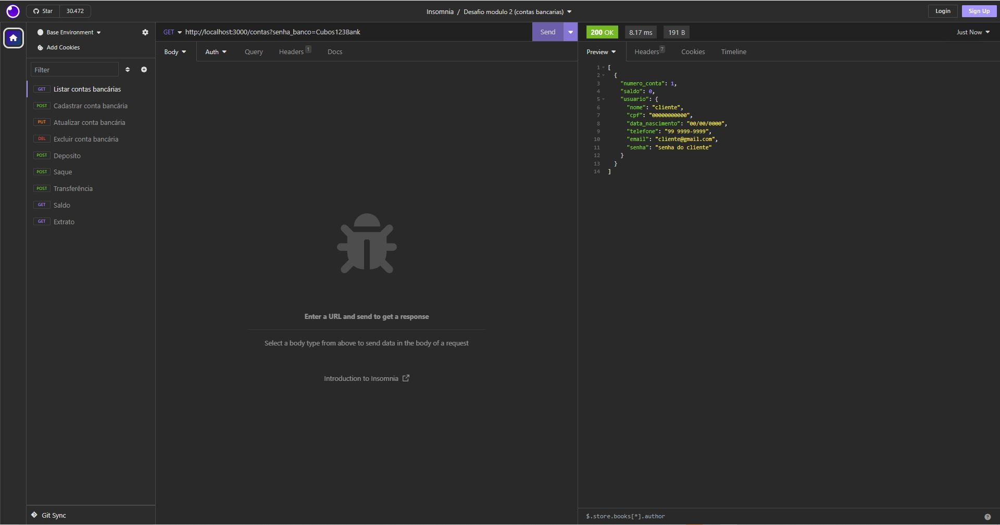

# API para um "Banco Digital"



Projeto do curso _Desenvolvimento de Software - Foco em Backend_ planejado pela [Cubos Academy](https://cubos.academy/).

## 💻 Pré-requisitos

Antes de começar, verifique se você atendeu aos seguintes requisitos:

- Você instalou a versão mais recente de `< Node.js / Insomnia >`
- Você tem uma máquina `<Windows / Linux / Mac>`. Indique qual sistema operacional é compatível / não compatível.

## 🔧 Instalando

Antes de utilizar a Api é necessário instalar alguns pacotes e um app.

Instalar o app INSOMNIA

```javascript
insomnia.rest/download.com
```

Instalar o FrameWork Express como dependencia

```javascript
$ npm install express
```

Instalar a biblioteca como dependencia

```javascript
$ npm install date-fns --save
```

Instalar a Bibliotecas Nodemon como dependencia de desenvolvimento

```javascript
$ npm install -D nodemon
```

## ⚙️ Executando a API

- Abra o terminal
- Dentro do terminal entre na camada da pasta geral do projeto
- Dentro do terminal digite: npm run dev
- Dentro do insonmia coloque você deve colocar o metodo correto de cada endPoint e o link https dos endPoints especificos que você quer acessar:
    - Listar contas bancárias: metodo (get) / https link (http://localhost:3000/contas?senha_banco=Cubos123Bank)
    - Cadastrar conta bancária: metodo (post) / https link (http://localhost:3000/contas)
    - Atualizar conta bancária: metodo (put) / https link (http://localhost:3000/contas/_NumeroContaDoUsuarioEspecifico_/usuario)
    - Excluir conta bancária: metodo (delete) / https link (http://localhost:3000/contas/_NumeroContaDoUsuarioEspecifico_)
    - Depósito: metodo (post) / https link (http://localhost:3000/transacoes/depositar)
    - Saque: metodo (post) / https link (http://localhost:3000/transacoes/sacar)
    - Transferência: metodo (post) / https link (http://localhost:3000/transacoes/transferir)
    - Saldo: metodo (get) / https link (http://localhost:3000/contas/saldo?numero_conta=_NumeroContaDoUsuarioEspecifico_&senha=_SenhaDoUsuarioQueChecarOSaldo_)
    - Extrato: metodo (get) / https link (http://localhost:3000/contas/extrato?numero_conta=_NumeroContaDoUsuarioEspecifico_&_SenhaDoUsuarioQueChecarOSaldo_)
- Em algumas funções da API (Ex:cadastrarConta, AtualizarConta, Deposito, Saque, Transferencias ) será necessário passar parametros no body da requisição, é só clicar em body no IMSOMNIA e escolher a opção JSON.
- Exemplos dos parametros de cada Função:

ListarContas / AtualizarConta

```javascript
{
	"nome": "cliente5",
	"cpf": "00000000005",
	"data_nascimento": "00/00/0000",
	"telefone": "99 9999-9999",
	"email": "cliente5@gmail.com",
	"senha": "senha do cliente"
}
```

Depósito 

```javascript
{
	"numero_conta": 2,
	"valor": 2200
}	
```

Saque

```javascript
{
	"numero_conta": 2,
	"valor": 100,
	"senha": "SenhaDaContaDoUsuarioEspecifico"
}	
```

Transferência

```javascript
{
	"numero_conta_origem": 2,
	"numero_conta_destino": 1,
	"valor": 275,
	"senha": "SenhaDaContaDoUsuarioEspecifico"
}	
```

## 🛠️ Construído com

- [javaScript](https://developer.mozilla.org/pt-BR/docs/Web/JavaScript)
- [Express](https://expressjs.com/pt-br/)
- [Nodemon](https://nodemon.io/)
- [date-fns](https://date-fns.org/)

## ✒️ Autor

<table>
  <tr>
    <td align="center">
      <a href="#">
        <br>
        <sub>
          <b>Caio Schwab</b>
        </sub>
      </a>
    </td>
</table>

## 🎁 Expressões de gratidão
- Conte a outras pessoas sobre este projeto 📢;
- Um agradecimento publicamente 🫂;
- etc.